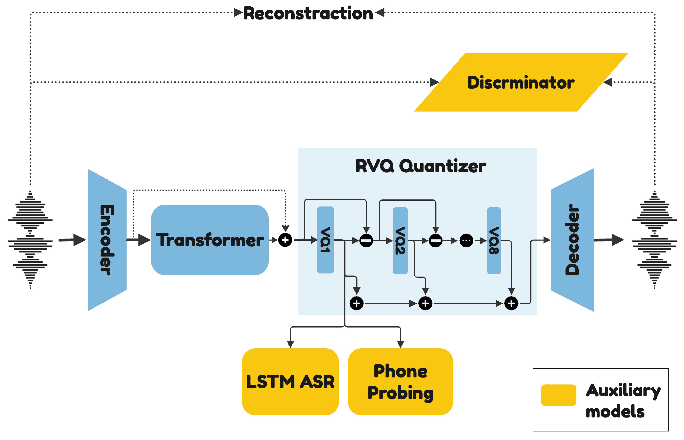

# PAST: Phonetic-Acoustic Speech Tokenizer

<a href='https://pages.cs.huji.ac.il/adiyoss-lab/PAST/'></a>  <a href='https://arxiv.org/abs/2505.14470'></a> <a href='https://huggingface.co/slprl/PAST'></a> <a href='https://scholar.googleusercontent.com/scholar.bib?q=info:5H8TEM1s5dcJ:scholar.google.com/&output=citation&scisdr=CgLXCgD-EJrK69d0aAI:AAZF9b8AAAAAaGpycALpmzVas5u54A7wQC1o7ww&scisig=AAZF9b8AAAAAaGpycL9jqrJtiAeIPFInh4kaf54&scisf=4&ct=citation&cd=-1&hl=iw'> </a> 

## Introduction

This repository contains the official implementation of **PAST**: *Phonetic-Acoustic Speech Tokenizer*.  
PAST is a unified framework that captures both phonetic and acoustic representations, outperforming previous hybrid speech tokenizers on phonetic accuracy, reconstruction fidelity, and speech language modeling performance.

Unlike prior approaches that rely on self-supervised models and vocoders, PAST uses direct phonetic supervision and a joint training scheme. We also introduce a **streamable**, causal variant for real-time applications.

<p align="center">
  <br>
  <em>Figure: Overview of the PAST architecture.</em>
</p>

## Quick Links

- [📢 Release](#release)
- [🔉 Samples](#samples)
- [⚙️ Installation](#installation)
- [🧠 Model List](#model-list)
- [🧪 Usage](#usage)
- [📚 Guides](#full-usage-guides)
- [📄 Citation](#citation)
- [🛡 License](#license)

## Release

- [2025/07] 🔥 Initial release of code, pretrained weights, and demo page

## Samples

Audio samples are available on our [project demo page](https://pastpaper2025.github.io/past).

## Installation

You can either install PAST directly via `pip` or clone the repository for development.

#### 🔧 Option 1: Install via pip

Create a fresh environment and install directly from GitHub:

```bash
conda create -n past_env python=3.10 -y
conda activate past_env
pip install git+https://github.com/slp-rl/PAST.git
```

#### 🛠 Option 2: Clone and install locally

Clone the repository and install dependencies manually:

```bash
git clone https://github.com/slp-rl/PAST.git
cd PAST
conda create -n past_env python=3.10 -y
conda activate past_env
pip install -r requirements.txt
```


## Model List

| Model | Variant | Description |
|:------|:--------|:------------|
| [PAST](https://huggingface.co/slprl/PAST/resolve/main/PAST.th?download=true) | Full | PAST model trained on LibriSpeech + TIMIT |
| [PAST-streamable](https://huggingface.co/slprl/PAST/resolve/main/PAST_streamable.th?download=true) | Streamable | Causal variant with 20ms look-ahead |

## Usage
see [demo](demo.ipynb) notebook for a full running example!

```python
# ---------------
# load PAST model
# ---------------
import torch
from past.models.past_model import PastModel
model = PastModel.from_pretrained("PAST")  # one of ['PAST', 'PAST_streamable']

# ----------------------------------------------------------------------
# Run on audio: PAST expects a batched input format [Batch, Channels, T]
# ----------------------------------------------------------------------
import torchaudio

def read_one_wav(path, target_sr):
    wav, sr = torchaudio.load(path)
    if sr != target_sr:
        wav = torchaudio.transforms.Resample(sr, target_sr)(wav)
    if wav.shape[0] == 2:
        wav = wav[:1]
    return wav.unsqueeze(0)

wav = read_one_wav("assets/1089-134686-0004.flac", model.sample_rate).to(model.device)

with torch.no_grad():
    codes, scale = model.encode(wav)
    reconstructed = model.decode(codes, scale)
```


## Full Usage Guides

#### 🔗 [Data Preparation](docs/data_preparation.md)
Learn how to prepare your dataset for training PAST, including alignment extraction using Wav2Vec2 and manifest generation.

#### 🔗 [Training](docs/training.md)
Step-by-step instructions for training PAST from scratch, with explanations of key configuration parameters and recommended practices.

#### 🔗 [Evaluation](docs/evaluation.md)
Evaluate the model’s performance in terms of speech reconstruction quality using SI-SNR and PESQ. The guide also outlines the other evaluation metrics (PNMI, ABX, WER) and explains how we used them in our experiments.


## Citation

If you use PAST in your work, please cite:

```
@article{har2025past,
    title={Past: Phonetic-acoustic speech tokenizer},
    author={Har-Tuv, Nadav and Tal, Or and Adi, Yossi},
    journal={arXiv preprint arXiv:2505.14470},
    year={2025}
  } 
```

## License

This project is released under the MIT License. See the [LICENSE](LICENSE) file for details.
